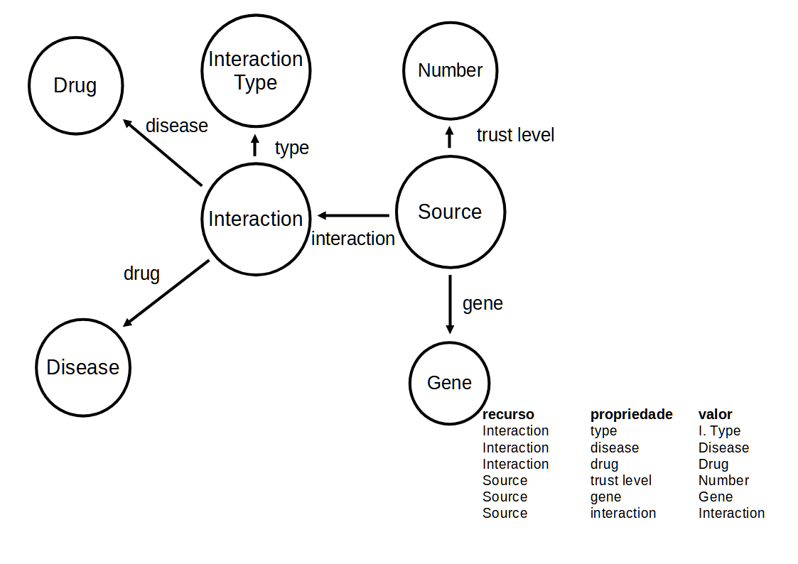
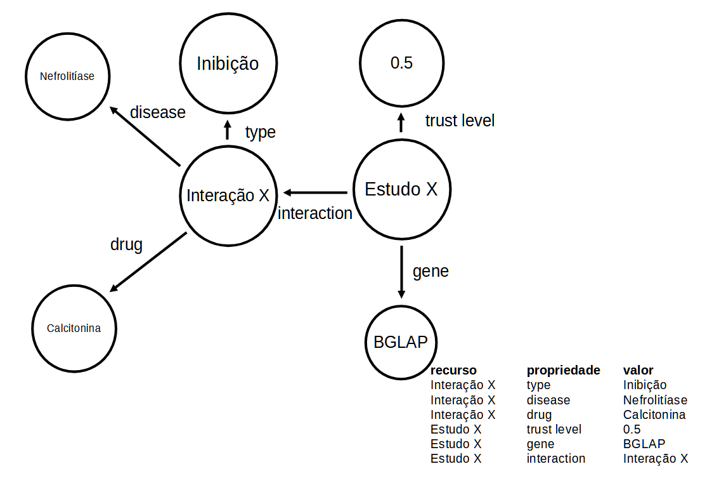

# Aluno

* `222903`: `Nicolas Bissoli Nattis`

## Exemplo de Grafo de Conhecimento - para publicar ou enriquecer

Classes:

Exemplo de instância para calcitonina e nefrolitíase (pedras nos rins):

## Perguntas de pesquisa ou queries

1. Selecione as doenças que estão em interações de inibição involvendo a calcitonina.

2. Selecione as interações que tem fontes com o gene BGLAP.

3. Qual o nível de confiança do estudo Y?
